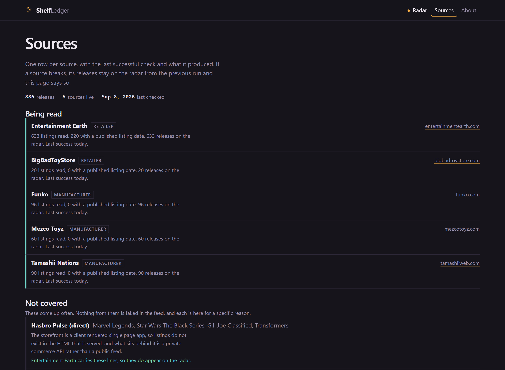

# ShelfLedger

[](https://github.com/TheAgencyMGE/shelfledger/actions/workflows/deploy.yml)
[](https://github.com/TheAgencyMGE/shelfledger/actions/workflows/release-calendar.yml)
[](LICENSE)

Free, open-source action figure release radar. Track new announcements,
preorders, restocks and releases across manufacturers and retailers without an
account.

**[Open the radar](https://theagencymge.github.io/shelfledger/)**

## Why

Finding out what is coming out is annoying. Every manufacturer announces on its
own site on its own schedule, retailers open preorders at random hours, and the
sites that aggregate any of it want an email address first. I kept missing
preorder windows on figures I actually wanted.

This reads public listing pages once a day, merges them into one feed, and puts
every filter in the URL so a view like "Marvel Legends preorders" is just a link
you can bookmark. No account, because there is nothing to log into.

It is only a radar. It does not track what you own.

## What "new" actually means here

This is the part that was broken and got rebuilt, so it is worth being precise.

**A product is never called new because ShelfLedger noticed it.** The day a row
entered the dataset is stored as `firstSeenByShelfLedger`, shown on the
[sources page](https://theagencymge.github.io/shelfledger/sources/), and is
never read by the code that decides what is new. That was the old bug: a Mezco
figure from mid-2025 turned up under "just announced" in late 2026 purely
because the scraper had just started looking.

What counts instead:

| Field | Where it comes from |
| ----- | ------------------- |
| `announcedDate` | A date the source itself published. Entertainment Earth stamps each tile with the day it went up and whether it was a new preorder or a new arrival |
| `preorderDate` | When preorders opened, from a retailer ribbon or a manufacturer's own preorder date |
| `releaseDate` / `releaseWindow` | Expected release, from the manufacturer where possible |
| `arrivalDate` | When stock actually landed |
| `restockedAt` | Derived from a real state change: out of stock last run, in stock now |

Four rules enforce it:

1. **No published date, no announcement.** A listing with no ribbon gets
   `announcedDate: null` and can never appear under Just announced.
2. **A first run is a baseline.** When a source is read for the first time, every
   row from it is marked `baseline` and nothing can be a restock, because there
   is nothing to compare against.
3. **Stale releases lose their announcement.** If a product came out more than
   120 days ago, any announcement date is stripped. A retailer relisting an old
   figure is not news.
4. **Announcements cannot be in the future.** A ribbon date that would resolve
   ahead of today belongs to last year.

`test/merge.test.mjs` and `test/stages.test.mjs` cover all four, including a test
named exactly for the original bug.

## Coverage

Nothing in the feed is invented, and nothing is listed as supported because it
would look good in a README.

**Working now:**

| Source | Kind | What it gives |
| ------ | ---- | ------------- |
| Entertainment Earth | Retailer | The backbone. 12 listing pages, manufacturer, franchise, category, SKU, price, stock, and a real listing date per tile |
| BigBadToyStore | Retailer | Names, manufacturer, price and preorder status from the one listing its robots.txt allows |
| Funko | Manufacturer | Item numbers, limited run sizes and drop dates |
| Mezco Toyz | Manufacturer | One:12 Collective and 5 Points, with shipping windows |
| Tamashii Nations | Manufacturer | S.H.Figuarts and the rest of Bandai's collector lines, with preorder and release dates |

Lines with real coverage, inferred only where a title actually names them:
Marvel Legends, Star Wars The Black Series and The Vintage Collection, G.I. Joe
Classified, Transformers and Transformers Generations, DC Multiverse, Masters of
the Universe, S.H.Figuarts, S.H.MonsterArts, Figuarts ZERO, Chogokin, Robot
Damashii, MAFEX, One:12 Collective, 5 Points, Ultimates and ReAction, Pop! and
its variants.

**Not working, with the actual reason:**

- **Hasbro Pulse direct.** Client-rendered single page app; the listings are not
  in the served HTML. Hasbro products still reach the radar through retailers.
- **NECA direct.** `robots.txt` disallows `/products/` and `/productlist/`. NECA
  products still reach the radar through retailers.
- **McFarlane direct.** Marketing showcase with no server-rendered product data
  and a sitemap that 404s. McFarlane products still reach the radar through
  retailers.
- **Sideshow and Hot Toys.** Every request is redirected into a virtual waiting
  room queue. Getting around that would mean evading traffic control.
- **Medicom direct.** No product sitemap and an empty product endpoint. MAFEX
  appears when a covered retailer lists it.
- **BigBadToyStore filtered views.** `robots.txt` allows `/Search` but disallows
  `/Search?*`, and every sorted or filtered listing is a query string on that
  path. That is why BBTS contributes a small number of rows.

The [sources page](https://theagencymge.github.io/shelfledger/sources/) builds
both lists from the live data, so they cannot drift from what the scraper does.

## The radar

Tabs: Just announced, New preorders, Releasing soon, Available now, New
arrivals, Restocks, Exclusives. A release can be in several at once.

Filters: manufacturer, line, franchise, seller, category, availability, release
date range, price range, and full text search.

Every filter is in the query string, so any view is a URL:

```
/?stage=new-preorders&line=Marvel%20Legends
/?maker=Medicom&stage=just-announced
```

The same figure listed by a retailer and its manufacturer is merged into one
release showing every place to buy it, with each seller's own price and stock.
The manufacturer is trusted for what a product is; retailers for price, stock
and listing dates.

## Feeds, exports and API

Everything is a static file, so all of it works on GitHub Pages.

| What | Where |
| ---- | ----- |
| RSS | [`/feed.xml`](https://theagencymge.github.io/shelfledger/feed.xml) |
| JSON Feed | [`/feed.json`](https://theagencymge.github.io/shelfledger/feed.json) |
| Per maker and per line RSS | [`/feeds/index.json`](https://theagencymge.github.io/shelfledger/feeds/index.json) lists them |
| Full CSV | [`/radar.csv`](https://theagencymge.github.io/shelfledger/radar.csv) |
| Calendar of dated releases | [`/radar.ics`](https://theagencymge.github.io/shelfledger/radar.ics) |
| Raw data, all fields | [`/data/releases.json`](https://theagencymge.github.io/shelfledger/data/releases.json) |

The radar page also exports whatever you have filtered to as CSV, JSON or a
calendar file, built in the page from data it already has.

## Screenshots

The radar, with stage tabs, filters and a seller under every release.


Source health, built from the live feed.



On a phone.


## Privacy

No accounts. No analytics of any kind, including the privacy-branded ones. No
error reporting, no third-party fonts, no embeds, no iframes, no ads, no
fingerprinting. There is no client-side storage at all: filters live in the URL,
not in your browser.

`npm run lint` fails the build on a third-party script, an external stylesheet, a
webfont, a known analytics snippet, or a `fetch()` to an absolute URL, and CI
runs it against the source and the built output on every push.

## Running it

```bash
git clone https://github.com/TheAgencyMGE/shelfledger.git
cd shelfledger
npm run build
npm run serve      # http://localhost:8787/shelfledger/
npm run check      # lint, tests, build
npm run scrape     # refresh data/releases.json from live sources
```

Nothing to `npm install`. No runtime dependencies, and the build, tests and
scrapers use only Node's standard library. Node 20 or newer. Build with
`SITE_BASE=/` to serve from the root of a domain.

## Adding a source

One file in `scripts/sources/`, exporting `meta` and `collect()`, plus a line in
`index.mjs`. The rules, which are what keep this welcome on other people's
servers:

- **Listing pages only.** Never request individual product pages.
- **Obey `robots.txt`.** The `allowed()` predicate is handed to your adapter.
- **Prefer structured data** the site already publishes.
- **Only set `listedDate` when the source published one.** This is the rule that
  keeps "new" honest. If a source does not date its listings, leave it null.
- **Fail loudly.** Throw rather than returning a half-built list; the
  orchestrator carries your previous rows forward and reports the failure.

Add parsing tests against a fixed markup sample in `test/sources.test.mjs`. Tests
never hit the network. If a manufacturer cannot be automated, add it to
`UNSUPPORTED` with the concrete reason rather than stubbing it with fake data.
See [CONTRIBUTING.md](CONTRIBUTING.md).

## How the data is built

A [scheduled workflow](.github/workflows/release-calendar.yml) runs at noon
Pacific. It checks `robots.txt` per host, runs each adapter, merges the listings,
applies history, and commits `data/releases.json` only when something changed. A
source failing does not fail the run: its rows carry forward and the site reports
it as stale. The run only refuses to write when every source fails.

The job identifies itself honestly:

```
ShelfLedgerBot/1.0 (+https://github.com/TheAgencyMGE/shelfledger; open-source collection tracker; contact via GitHub issues)
```

If you maintain one of these sites and want it to stop, open an issue and it
will.

## Licence

MIT. See [LICENSE](LICENSE). Fork it, run your own copy.

## Not affiliated with anyone

ShelfLedger is an independent, fan-made tool. It is not affiliated with, endorsed
by, or sponsored by Entertainment Earth, BigBadToyStore, Funko, Mezco Toyz,
Bandai, Hasbro, NECA, McFarlane Toys, Sideshow, Medicom, or any other
manufacturer, distributor or retailer. All product names, trademarks and brands
are the property of their respective owners, and appear here only to describe the
items being tracked.
