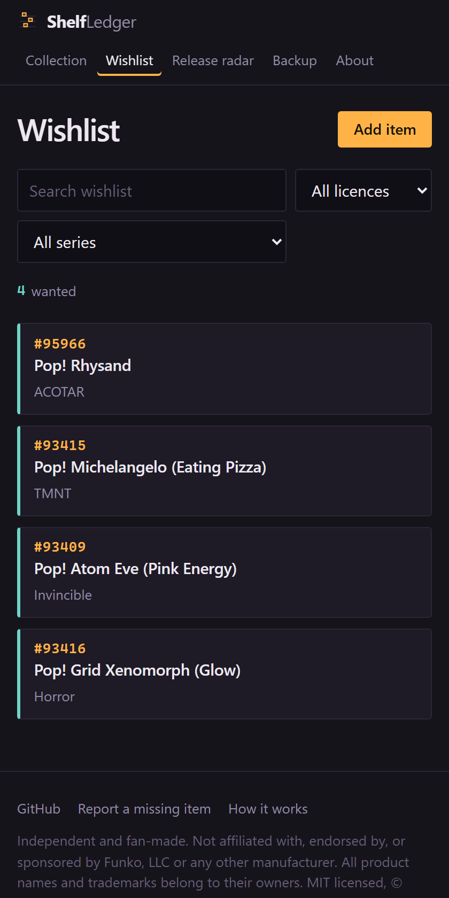

# ShelfLedger

[](https://github.com/TheAgencyMGE/shelfledger/actions/workflows/deploy.yml)
[](https://github.com/TheAgencyMGE/shelfledger/actions/workflows/release-calendar.yml)
[](LICENSE)

A collection tracker for Funko Pops, action figures, and whatever else is on
your shelf. No account, no cloud, no ads. What you log stays in your browser.

**[Open it →](https://theagencymge.github.io/shelfledger/)**

## Why this exists

Every Funko tracker I tried wanted something. One wanted an email address before
it would let me add a single figure. One capped the free list at 100 items and
then asked for a subscription, for a list. A couple were fine right up until I
read what they did with the data, which was upload my entire collection to a
server and keep it there.

It's a list of toys. It should not require an account, and it should not live on
someone else's computer.

So this one doesn't have a server for your collection to go to. Not "we promise
not to look", there's no database, no login, no endpoint that accepts your
data. Your items go into IndexedDB, which is a database built into your own
browser, and they sit there. The whole app is static files on GitHub Pages.

The obvious cost: if you clear your browser data without exporting first, it's
gone, and nobody can get it back for you. That's the trade. Export is one button
and one file, and it's the first thing on the Backup page rather than buried in
settings.

## What it does

- Track what you **have**, **want**, and **had**, with multiple copies, boxed
  or loose, chase, and exclusives.
- **Scan barcodes** with your phone camera in the shop. Decoding happens on the
  device; no image and no number gets uploaded.
- **Search and filter** by licence, series, status, or free text.
- **Wishlist**, which is just the "want" items on their own page.
- **Release radar**, a calendar of new and upcoming drops, refreshed daily,
  with anything matching your wishlist flagged. Includes limited-run sizes,
  because "limited to 1,200 pieces" changes how hard you chase something.
- **Calendar reminders**, export the dates you care about as an `.ics` file and
  your own calendar app handles the reminders.
- **Export and import** your whole collection as one readable JSON file.
- Works **offline** and installs as an app on your phone.

An open catalogue of about 19,800 items ships with it, seeded from public
listings, with real item numbers. It is not complete, see
[the catalogue section](#the-catalogue-is-open-and-incomplete).

## Your data never leaves your browser

This is the whole point, so here's exactly what happens.

Your items and settings go into IndexedDB, a database built into your browser,
on your device. Nothing else. No cookies, no localStorage, no fingerprint.

Over the network the app asks for three things, all from the same domain as the
page: the pages and scripts themselves; `data/catalog/*.json`, the shared item
catalogue, fetched the first time you search; and `data/releases.json`, the
release calendar. Those are the same files for everyone who loads the site. No
query strings, no identifiers, no request bodies, nothing that says who asked.

What's absent matters as much. No analytics, and I mean none, not Google's, and
not the privacy-branded ones that promise they're the good kind. No error
reporting. No fonts from a CDN, which is incidentally why it loads fast. No
embeds, no iframes, no third-party scripts at all. If you want to know whether
anyone uses this, the stars and the issue tracker are the only telemetry there
is.

The release radar is the one feature where you'd expect a server to be involved,
so it's worth spelling out. The release file is public and identical for every
visitor. Your browser downloads it and compares it against your local wishlist
itself. The flags you see were worked out on your device, and nothing that
produced them was sent anywhere.

None of this is something you have to take on faith. `npm run lint` fails the
build if anything introduces a third-party script, an external stylesheet, a
webfont, a known analytics snippet, or a `fetch()` to an absolute URL, and CI
runs it against the source and again against the built output on every push. A
promise in a README is worth less than a check that breaks the deploy.

## Screenshots

The collection. The stripe on each card is its status, and the number is the
item number off the box.


The radar. Wishlist matches get a teal stripe. Run sizes come from the public
drop calendar.


The wishlist on a phone, which is where you'll actually use it.



These are generated by `npm run screenshots`, which seeds a demo collection into
a throwaway copy of the build. No demo data or seeding code ships in the app.

## Using it

**Hosted:** <https://theagencymge.github.io/shelfledger/>. Nothing to sign up
for. On a phone, use "Add to Home Screen" and it behaves like an app and works
offline.

**Locally:**

```bash
git clone https://github.com/TheAgencyMGE/shelfledger.git
cd shelfledger
npm run build
npm run serve
```

Then open <http://localhost:8787/shelfledger/>. There's nothing to `npm install`
 the app ships no runtime dependencies and the build uses only Node's standard
library. Node 20 or newer.

To serve it from the root of a domain instead of a subpath, build with
`SITE_BASE=/`.

## How the release radar works

A [scheduled workflow](.github/workflows/release-calendar.yml) runs once a day
and reads five of Funko's own public catalogue pages: new releases, coming soon,
pre-orders, exclusives, and the limited edition drop calendar. Those pages
publish schema.org structured data in the HTML, so one request per page gets the
name, item number, price, and stock state without touching a single product
page. The drop calendar additionally prints the drop date and the run size on
each tile, which is where "8 Sep, 1,200 pieces" comes from.

The job identifies itself honestly:

```
ShelfLedgerBot/1.0 (+https://github.com/TheAgencyMGE/shelfledger; open-source collection tracker; contact via GitHub issues)
```

It reads `robots.txt` first and obeys it, makes five requests spaced well apart,
and runs at most once every 24 hours. If you maintain that site and want it to
stop, open an issue and it will.

The result is written to [`data/releases.json`](data/releases.json) and committed
only when something actually changed, so the git history is a readable log of
what got announced when. Dates and prices are whatever the source said at the
time, and they do change.

Scraping is only as stable as someone else's markup. If the calendar goes stale,
the likely cause is a renamed category path or a switch to client-side
rendering; there's a maintenance note at the top of
[`scripts/scrape-releases.mjs`](scripts/scrape-releases.mjs).

## The catalogue is open, and incomplete

[`data/catalog.json`](data/catalog.json) is a plain, versioned file in this repo,
one item per line so that adding a figure is a one-line diff. Around 19,800
items with official item numbers, of which roughly 600 have had their names and
licences confirmed against structured listings. The rest had names derived from
product URLs and are marked `"verified": false`, usually right, occasionally
missing a hyphen or an apostrophe.

It's missing plenty, especially older releases, regional exclusives, and almost
all barcodes. That last one is the biggest gap, since barcodes are what make
scanning find something.

Two ways to help, and neither requires you to be a programmer:

- [Open an issue](https://github.com/TheAgencyMGE/shelfledger/issues/new?template=missing-item.yml)
  with what's on the box.
- Edit `data/catalog.json` on github.com and add a line. See
  [CONTRIBUTING.md](CONTRIBUTING.md), which walks through it.

You never have to wait for either. Anything you type into the app yourself is a
real entry and works exactly like a catalogued one, the catalogue just saves
you typing.

## Roadmap

Not built yet. Roughly in the order they're likely to happen:

- A duplicate detector, for flagging the same figure logged twice. Happens
  constantly if you buy lots.
- Better catalogue coverage. Barcodes above all, then older releases.
- Action figures, anime figures and statues as first-class categories. The
  storage and the UI already handle them; there's just no catalogue data yet.
- A shareable read-only shelf: a link that encodes the collection in the URL
  itself, so you can show off a shelf without anything being stored on a server.
  URL length limits make this harder than it sounds and it may not survive
  contact with a large collection.
- Scarcity numbers in the collection view, not only on the radar.

Not planned, ever: accounts, cloud sync, price tracking that phones home, or
analytics.

## Licence

MIT. See [LICENSE](LICENSE). Take it, fork it, run your own copy.

The catalogue data in `data/` is factual information about products, names and
item numbers, contributed for anyone to use.

The one vendored dependency is [ZXing](https://github.com/zxing-js/library) (MIT)
for barcode decoding in browsers without a built-in decoder. It's committed to
the repo rather than loaded from a CDN, for the reason you'd expect. See
[`src/assets/vendor/README.md`](src/assets/vendor/README.md).

## Not affiliated with anyone

ShelfLedger is an independent, fan-made tool. It is not affiliated with,
endorsed by, sponsored by, or connected to Funko, LLC, or any other
manufacturer, distributor, or retailer. "Funko" and "Pop!" are trademarks of
Funko, LLC. All product names, trademarks, and brands are the property of their
respective owners, and appear here only to describe the items being catalogued.
