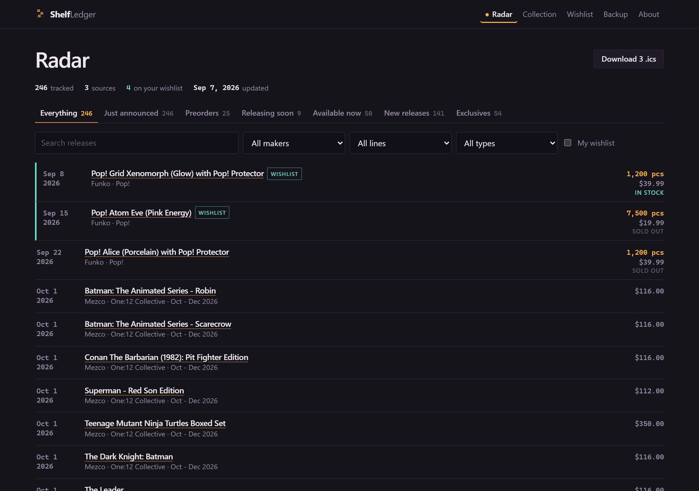
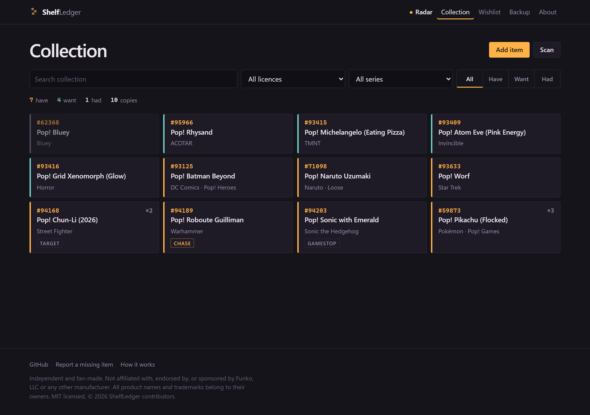
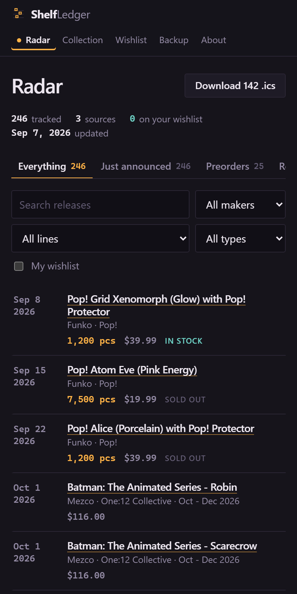

# ShelfLedger

[](https://github.com/TheAgencyMGE/shelfledger/actions/workflows/deploy.yml)
[](https://github.com/TheAgencyMGE/shelfledger/actions/workflows/release-calendar.yml)
[](LICENSE)

Open-source release radar for action figures, Funko Pops, anime figures and
collectibles. Track new announcements, preorders, exclusives and upcoming drops
without an account.

**[Open the radar](https://theagencymge.github.io/shelfledger/)**

## Why this exists

Finding out what is coming out is weirdly hard. Every manufacturer announces on
its own site on its own schedule, half the news lives in Instagram posts, and
the sites that aggregate it want an email address before they will show you a
list. I kept missing preorder windows on figures I actually wanted.

So this reads the manufacturers' own public listing pages once a day, puts them
in one feed, and flags anything that lines up with a wishlist kept in your own
browser. There is no account, because there is nothing to log into. Your
wishlist never goes into a request.

## What it actually covers

This is the honest version. Nothing in the feed is invented, and nothing is
listed as supported because it would look good in a README.

**Working now:**

| Source | Lines | How it is read |
| ------ | ----- | -------------- |
| Funko | Pop!, Bitty Pop!, Pocket Pop!, Vinyl Soda | Five category pages that publish schema.org product data |
| Mezco Toyz | One:12 Collective, 5 Points | Three server-rendered category pages |
| Tamashii Nations | S.H.Figuarts, Figuarts ZERO, Robot Damashii, Chogokin and others | The front page listing, with dates in `datetime` attributes |

Nine requests a day in total, none of them to an individual product page.

**Asked for a lot, not working, with the actual reason:**

- **Hasbro Pulse** (Marvel Legends, Black Series, G.I. Joe Classified,
  Transformers). The storefront is a client-rendered single page app, so the
  listings do not exist in the HTML that gets served. What sits behind it is a
  private commerce API, not a public feed.
- **NECA.** `necaonline.com/robots.txt` disallows `/products/` and
  `/productlist/` for every crawler, and that is where the listings are.
- **McFarlane Toys.** The site is a marketing showcase. No server-rendered
  product data, no prices, and the sitemap it advertises returns a 404.
- **Sideshow and Hot Toys.** Every request gets redirected into a virtual
  waiting room queue. Getting around that would mean evading a system built to
  control traffic.
- **MAFEX and Medicom.** The store publishes no product sitemap and its product
  endpoint returns nothing.

Each of these has an entry in
[`scripts/sources/index.mjs`](scripts/sources/index.mjs) with its reason and
what would have to change. The
[about page](https://theagencymge.github.io/shelfledger/about/) builds both
lists from the live data, so it cannot drift from what the scraper really does.

## The radar

Releases are sorted into the buckets you actually think in, and one release can
sit in several at once: just announced, preorders, releasing soon, available
now, new releases, and exclusives or limited runs.

On top of that, filter by manufacturer, line and type, search across everything,
or narrow to your wishlist. Each row shows the release date or shipping window,
price, availability, run size where the source states one, and a link to the
listing it came from. Anything discovered in the latest run is marked, so new
announcements stand out without you hunting for them.

Dated rows export as an `.ics` file, so reminders happen in your own calendar
app instead of needing push notifications.

## Tracking your own shelf

Secondary to the radar now, but all still here. Log what you **have**, **want**
and **had**, with copies, condition, chase and exclusives. Scan barcodes with
your phone camera, decoded on the device. Search and filter. Export and import
everything as one JSON file.

The wishlist is what makes the radar personal, so it earns its place.

## Your data never leaves your browser

Your collection and wishlist go into IndexedDB, in your browser, on your device.
Nothing else. No cookies, no localStorage, no accounts.

Over the network the app asks for three things, all from the same domain as the
page: the pages and scripts, `data/releases.json`, and `data/catalog/*.json`
when you search. Those are the same files for everyone who loads the site. No
query strings, no identifiers, no request bodies.

No analytics, and I mean none, not Google's and not the privacy-branded ones. No
error reporting. No fonts from a CDN. No embeds, no iframes, no third-party
scripts at all.

Wishlist matching is the one feature where you would expect a server. The feed
is public and identical for every visitor; your browser downloads it and does
the comparison itself. The flags you see were worked out on your device.

None of that is something you have to take on faith. `npm run lint` fails the
build on a third-party script, an external stylesheet, a webfont, a known
analytics snippet, or a `fetch()` to an absolute URL, and CI runs it against
both the source and the built output on every push.

## Screenshots

The radar. Stage tabs across the top, wishlist matches marked, a source link on
every row.



Your own shelf. The stripe on each card is its status, the number is the item
number off the box.



On a phone, which is where you check a preorder window while standing in a shop.



Generated by `npm run screenshots`, which seeds a demo collection into a
throwaway copy of the build. No demo data ships in the app.

## Running it

**Hosted:** <https://theagencymge.github.io/shelfledger/>. Nothing to sign up
for. On a phone, use "Add to Home Screen" and it works offline.

**Locally:**

```bash
git clone https://github.com/TheAgencyMGE/shelfledger.git
cd shelfledger
npm run build
npm run serve
```

Then open <http://localhost:8787/shelfledger/>. There is nothing to
`npm install`. The app ships no runtime dependencies, and the build, tests and
scrapers use only Node's standard library. Node 20 or newer.

Build with `SITE_BASE=/` to serve from the root of a domain instead of a
subpath.

## How the feed is built

A [scheduled workflow](.github/workflows/release-calendar.yml) runs at noon
Pacific. Each source is an adapter in [`scripts/sources`](scripts/sources) that
only ever reads listing pages. The orchestrator checks `robots.txt` per host,
runs the adapters in turn, and keeps going when one breaks: a failed source
keeps its entries from the previous run and is reported in the output, so the
radar can say it is stale instead of silently losing rows. The run only refuses
to write when every source fails.

The job identifies itself honestly:

```
ShelfLedgerBot/1.0 (+https://github.com/TheAgencyMGE/shelfledger; open-source collection tracker; contact via GitHub issues)
```

It reads `robots.txt` first and obeys it, spaces its requests out, and runs at
most once every 24 hours. If you maintain one of these sites and want it to
stop, open an issue and it will.

Results go to [`data/releases.json`](data/releases.json), committed only when
something changed, so the history is a readable log of what got announced when.
Prices and dates are whatever the source said at the time.

Scraping is only as stable as someone else's markup. A source reporting zero
products usually means a renamed path or a switch to client-side rendering.
There is a maintenance note at the top of
[`scripts/scrape-releases.mjs`](scripts/scrape-releases.mjs).

## Adding a manufacturer

Write one file in `scripts/sources/`, export `meta` and `collect()`, and add it
to the list in `index.mjs`. The rules an adapter follows:

- read listing pages only, never individual product pages;
- prefer structured data the site already publishes over parsing prose;
- return the shared release shape, so the radar never needs to know which source
  a row came from;
- fail loudly in the adapter rather than returning half a result.

`test/sources.test.mjs` runs every adapter against fixed markup samples, so CI
never depends on someone else's site being up. See
[CONTRIBUTING.md](CONTRIBUTING.md).

## The catalogue

Separate from the radar, `data/catalog.json` holds about 19,800 items with
official item numbers. It powers autocomplete when you add something by hand,
and barcode lookups when you scan. It is missing plenty, especially older
releases and almost all barcodes. One item is one line, so adding one is a
one-line pull request.

## Roadmap

Not built yet:

- More manufacturers, starting with anything on the unsupported list that
  becomes readable.
- Retailer exclusives from the shops rather than only from the makers.
- A duplicate detector for the collection, which matters if you buy lots.
- A shareable read-only shelf encoded in a URL, with nothing stored server side.

Not planned, ever: accounts, cloud sync, or analytics.

## Licence

MIT. See [LICENSE](LICENSE). Take it, fork it, run your own copy.

The one vendored dependency is [ZXing](https://github.com/zxing-js/library)
(MIT), for barcode decoding in browsers without a built-in decoder. It is
committed to the repo rather than loaded from a CDN, for the reason you would
expect.

## Not affiliated with anyone

ShelfLedger is an independent, fan-made tool. It is not affiliated with,
endorsed by, or sponsored by Funko, Mezco Toyz, Bandai Spirits, Hasbro, NECA,
McFarlane Toys, Sideshow, Medicom, or any other manufacturer, distributor or
retailer. All product names, trademarks and brands are the property of their
respective owners, and appear here only to describe the items being tracked.
